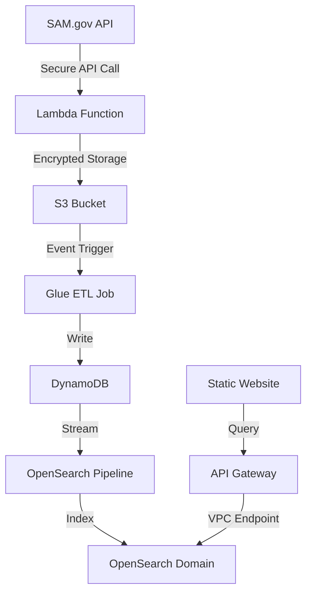
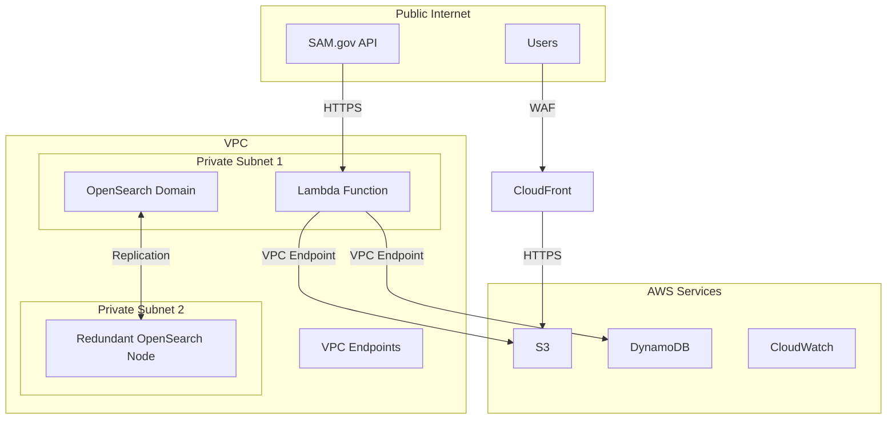

# ClearCheck - Let's run a ClearCheck on this entity

This project implements a secure data pipeline to collect, process, and display exclusion data from SAM.gov.

## Architecture Overview

### High-Level Architecture


### Security Architecture


## Security Features

1. Network Security
   - VPC with private subnets
   - Security groups with minimal required access
   - VPC Flow Logs enabled
   - WAF protection for API endpoints

2. Data Security
   - KMS encryption for data at rest
   - HTTPS/TLS for data in transit
   - S3 bucket encryption
   - Public access blocking for sensitive resources

3. Access Control
   - IAM roles with least privilege
   - Resource-based policies
   - Service control policies
   - Regular access auditing

4. Monitoring and Compliance
   - CloudWatch Logs
   - CloudTrail enabled
   - GuardDuty for threat detection
   - Security Hub integration

## Prerequisites

- AWS CLI configured
- Terraform >= 1.0.0
- Python >= 3.9
- SAM.gov API key

## Project Structure

```plaintext
mf-codeblooded-project/
├── terraform/           # Infrastructure as Code
├── src/                # Application Source Code
│   ├── lambda/         # Lambda Functions
│   ├── glue/          # ETL Scripts
│   └── website/       # Static Website
└── scripts/           # Deployment Scripts
```

## Deployment

1. Initialize Terraform:
```bash
cd terraform
terraform init
```

2. Set up environment variables:
```bash
export TF_VAR_environment="prod"
export TF_VAR_aws_region="us-east-1"
```

3. Deploy infrastructure:
```bash
terraform apply
```

## Monitoring

The infrastructure includes comprehensive monitoring:

1. CloudWatch Dashboards for:
   - Lambda performance
   - DynamoDB metrics
   - OpenSearch cluster health
   - API Gateway requests

2. Alerts for:
   - Lambda errors
   - DynamoDB throttling
   - OpenSearch cluster status
   - High latency
   - Security events

## Cost Optimization

- Auto-scaling policies
- Reserved instances for OpenSearch
- S3 lifecycle policies
- DynamoDB on-demand capacity

## Disaster Recovery

1. Backup Strategy:
   - S3 versioning
   - DynamoDB point-in-time recovery
   - OpenSearch snapshots

2. Recovery Procedures:
   - Multi-AZ deployment
   - Automated failover
   - Regular disaster recovery testing


## Contributing

1. Fork the repository
2. Create a feature branch
3. Submit a pull request
